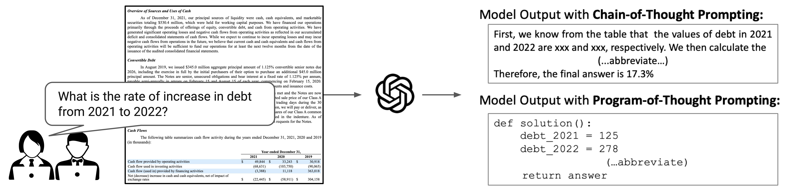

## DocMath-Eval
[**🌐 Homepage**](https://docmath-eval.github.io/) | [**🤗 Dataset**](https://huggingface.co/datasets/yale-nlp/DocMath-Eval) | [**📖 arXiv**](https://arxiv.org/abs/2311.09805) | [**GitHub**](https://github.com/yale-nlp/DocMath-Eval)

The data and code for the paper [DocMath-Eval: Evaluating Math Reasoning Capabilities of LLMs in Understanding Long and Specialized Documents](https://arxiv.org/abs/2311.09805). 
**DocMath-Eval** is a comprehensive benchmark focused on numerical reasoning within specialized domains. It requires the model to comprehend long and specialized documents and perform numerical reasoning to answer the given question. 

<p align="center">

</p>

## DocMath-Eval Dataset
All the data examples were divided into four subsets:

- **simpshort**, which is reannotated from [TAT-QA](https://aclanthology.org/2021.acl-long.254/) and [FinQA](https://aclanthology.org/2021.emnlp-main.300/), necessitates simple numerical reasoning over short document with one table
- **simplong**, which is reannotated from [MultiHiertt](https://aclanthology.org/2022.acl-long.454/), necessitates simple numerical reasoning over long document with multiple tables;
- **compshort**, which is reannotated from [TAT-HQA](https://aclanthology.org/2022.acl-long.5/), necessitates complex numerical reasoning over short document with one table;
- **complong**, which is annotated from scratch by our team, necessitates complex numerical reasoning over long document with multiple tables.

For each subset, we provide the *testmini* and *test* splits. 

You can download this dataset by the following command:

```python
from datasets import load_dataset

dataset = load_dataset("yale-nlp/DocMath-Eval")

# print the first example on the complong testmini set
print(dataset["complong-testmini"][0])
```

The dataset is provided in json format and contains the following attributes:

```
{
    "question_id": [string] The question id
    "source": [string] The original source of the example (for simpshort, simplong, and compshort sets)
    "original_question_id": [string] The original question id (for simpshort, simplong, and compshort sets)
    "question": [string] The question text
    "paragraphs": [list] List of paragraphs and tables within the document
    "table_evidence": [list] List of indices in 'paragraphs' that are used as table evidence for the question
    "paragraph_evidence": [list] List of indices in 'paragraphs' that are used as text evidence for the question
    "python_solution": [string] Python-format and executable solution. This feature is hidden for the test set
    "ground_truth": [float] Executed result of 'python_solution'. This feature is hidden for the test set
}
```

## Experiments
### Environment Setup
The code is tested on the following environment:
- python 3.11.5
- CUDA 12.1, PyTorch 2.1.1
- run `pip install -r requirements.txt` to install all the required packages

### LLM Inference on DocMath-Eval
We provide inference scripts for running various LLMs on DocMath-Eval:
- `scripts/inference/run_retriever.sh` for running the retriever models on the complong subset to retrieve the top-n question-relevant evidence
- `scripts/inference/run_api*.sh` for running proprietary LLMs. Note that we developed a centralized API proxy to manage API calls from different organizations and unify them to be compatible with the OpenAI API. If you use the official API platform, you will need to make some modifications.
- `scripts/inference/run_vllm*.sh` for running all other open-sourced LLMs (e.g., Llama-3, Qwen, Gemma) that are reported in the paper and supported by the [vLLM](https://github.com/vllm-project/vllm) framework
- `scripts/inference/run_rag_analysis.sh` for running the ablation study of RAG setting on the complong subset

### Automated Evaluation
We develop a heuristic-based method to automatically evaluate the accuracy of CoT and PoT outputs:
- `scripts/evaluate_all.sh` for evaluating PoT and CoT outputs on testmini sets
- `scripts/evaluation/evaluate_retriever_recall.sh` for evaluating the retriever recall on the complong subset
- `scripts/evaluation/evaluate_rag_analysis.sh` for evaluating the ablation study of RAG setting on the complong subset

### Model Output
We provide all the model outputs reported in the paper at [Google Drive](https://drive.google.com/drive/folders/1b7m2oxgtzYispbzZylrXVWkLyeIoKxIt?usp=sharing), specifically:
- `llm_outputs`: The CoT and PoT output from all the evaluated LLMs on both the testmini and test sets
- `retrieved_output`: The top-n retrieved evidence from the retriever models on the complong subset
- `rag_outputs`: The RAG outputs from the ablation study on the complong subset


### Leaderboard Submission
We maintain a [leaderboard](https://docmath-eval.github.io/) for the DocMath-Eval benchmark. To get the results on the test set, please send your result json file to [this email](mailto:yilun.zhao@yale.edu). The result json file should at least include these features:

```
[
    {
        "question_id": [string] The question id
        "output": [string] The model output
    }
]
```

## Contact
For any issues or questions, kindly email us at: Yilun Zhao (yilun.zhao@yale.edu).

## Citation

If you use the **DocMath-Eval** benchmark in your work, please kindly cite the paper:

```
@misc{zhao2024docmatheval,
      title={DocMath-Eval: Evaluating Math Reasoning Capabilities of LLMs in Understanding Long and Specialized Documents}, 
      author={Yilun Zhao and Yitao Long and Hongjun Liu and Ryo Kamoi and Linyong Nan and Lyuhao Chen and Yixin Liu and Xiangru Tang and Rui Zhang and Arman Cohan},
      year={2024},
      eprint={2311.09805},
      archivePrefix={arXiv},
      primaryClass={cs.CL},
      url={https://arxiv.org/abs/2311.09805}, 
}
```